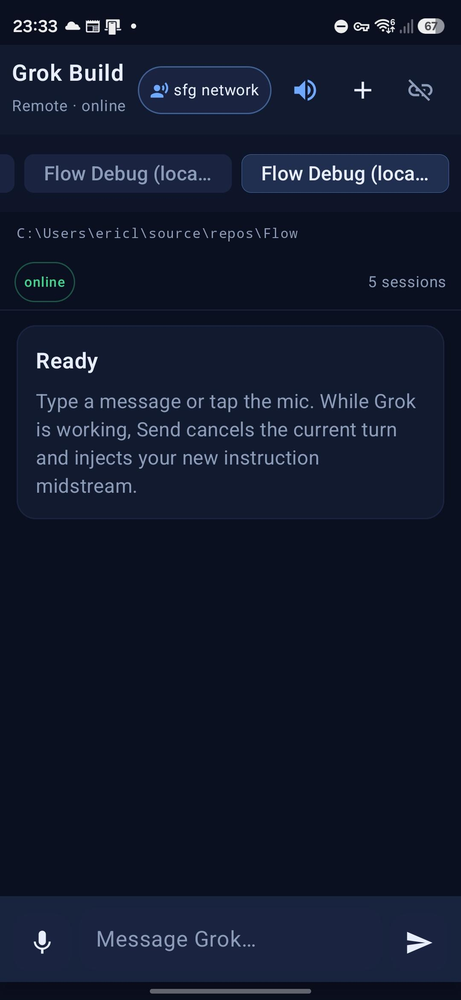
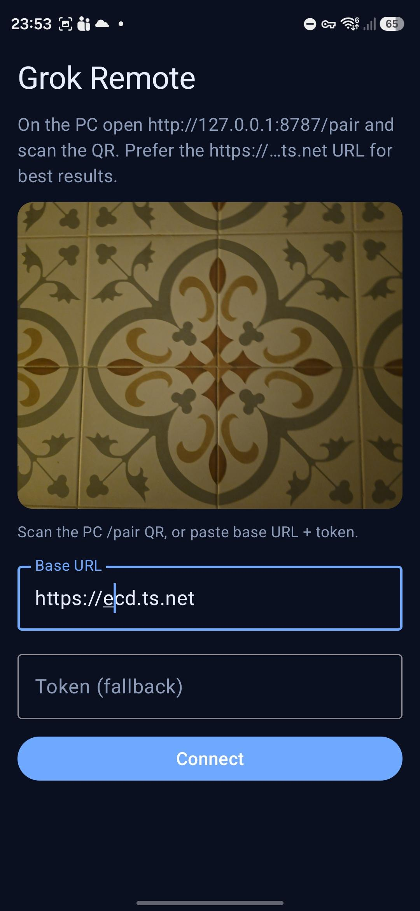
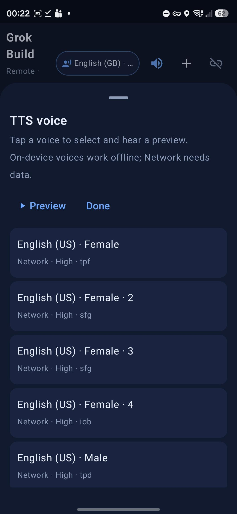
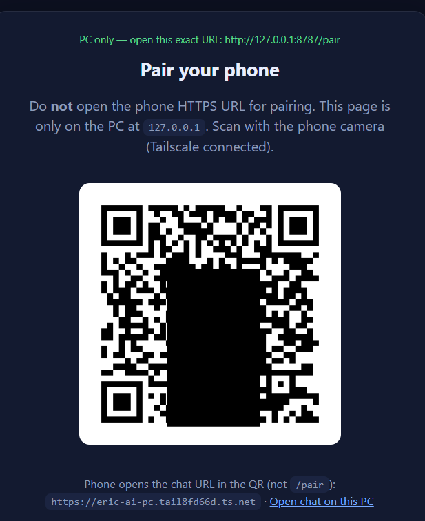

# Grok Remote

**Control local [Grok Build](https://x.ai) from your phone — without forking Grok, without reverse-engineering the TUI, and without exposing your agent to the public internet.**

Grok Remote is a thin, open-source remote for **your own machine**. It uses the same **official** surfaces xAI already ships:

- `grok agent serve` — long-lived Agent Client Protocol (ACP) over WebSocket  
- Session resume / history that already lives under `~/.grok`  
- Your existing login (OAuth or API key) on the PC  

Nothing here patches Grok. The bridge talks to stock `grok agent serve`. Unattended remote is not identical to the desktop TUI: `always_approve` is on by default, in-person prompts (`ask_user_question`) are skipped, and the phone only **opens a session when you pick it** (or re-enters the last one).

---

## What's new

Newest first. This is the living project, not a marketing sheet. The last **tagged** GitHub Release zip is **v0.2.0** (Windows service). Session picker / on-demand load is on `master` and will ship in the next zip.

| When | What actually changed |
|------|------------------------|
| **Now (v0.2+)** | **Windows service instead of logon scheduled tasks.** Task Scheduler only restarted when the *wrapper* exited with an error. If the wrapper died while Python/`grok` kept the port, a restart treated “port already open” as success and stopped watching — 502s for days on a PC that never sleeps. **GrokRemote** is now a delayed auto-start service: LocalSystem *supervisor only*; `grok agent serve` and the bridge run **as your user** via S4U (no password stored). SCM restarts the supervisor; a SYSTEM watchdog every minute force-starts it if `:2419` / `:8787` is dead. Opt-in: `install-startup.ps1 -UseScheduledTasks`. |
| **Now** | **Sessions on demand.** Config `projects[]` is not a whitelist and is not auto-resumed at boot (that was leftover from the old stdio bridge). The picker lists real chats under `~/.grok/sessions`. Last-used session is re-entered; otherwise you pick. **Show all** lists every on-disk session — nothing is unreachable. Idle 1MB threads are *not* loaded in the background. |
| **Now** | Phone UI: optional **thinking beep** (off by default), TTS no longer re-reads the previous reply while the model thinks, top bar no longer crushes the title into one-letter columns. |
| **v0.2.0** | First GitHub **Release** zip: PC installer + prebuilt APK so you do not need Android Studio. |
| **v0.1.x** | Public repo: Android client, `/pair` QR, `/dl` APK, Tailscale Serve path. |

---

## Screenshots

<p align="center">
  
  &nbsp;
  
  &nbsp;
  
  &nbsp;
  
</p>

<p align="center">
  <em>Chat</em> · <em>In-app pair</em> · <em>TTS voice picker</em> · <em>PC <code>/pair</code></em> (loopback-only; QR redacted)
</p>

---

## Why this exists

Grok Build is excellent at the desk. Away from the desk, you still want:

- The **same sessions** you already started on the PC  
- **Thinking + tool use** visible like the desktop client  
- **Voice** that isn’t a browser afterthought  
- **Secure** access that doesn’t open a random port on the internet  

Grok Remote is that remote: a small PC bridge + Android app (and a web fallback), all on top of **standard Grok agent serve**.

---

## Highlights

| Feature | What you get |
|---------|----------------|
| **No Grok modifications** | Uses `grok agent serve` and ACP — stock xAI CLI |
| **Windows service** | Survives logoff/crash better than logon tasks; optional `-UseScheduledTasks` |
| **`/pair` on the PC** | Loopback-only QR page; Tailscale clients get **403** on `/pair` |
| **QR login on Android** | Scan once; token stored in EncryptedSharedPreferences |
| **APK over the bridge** | PC `/pair` **Install** QR or phone `/dl` — no USB for updates |
| **Sessions on demand** | Disk catalog + last-used / picker / **Show all**; unused sessions stay cold |
| **TUI-shaped stream** | Thinking, tools, markdown replies, cancel + send-while-busy (interrupt) |
| **STT / TTS** | System recognizer + system TTS with **voice picker**; optional thinking beep |

---

## Architecture

```text
┌─────────────────────┐         encrypted mesh          ┌──────────────────────────────┐
│  Android app        │ ──────────────────────────────► │  Your PC                     │
│  (or mobile browser)│   e.g. Tailscale HTTPS          │                              │
│                     │   https://pc…ts.net/            │  Windows service GrokRemote: │
│  • QR pair          │                                 │   LocalSystem supervisor     │
│  • chat / think     │                                 │   children as your user      │
│  • tools / voice    │                                 │                              │
│  • cancel / inject  │                                 │  grok agent serve  (ACP/WS)  │
└─────────────────────┘                                 │         ▲                    │
                                                        │         │ WebSocket ACP      │
                                                        │         │ 127.0.0.1 only     │
                                                        │  Python bridge (this repo)   │
                                                        │  pair · download · sessions  │
                                                        └──────────────────────────────┘
```

**Security model (single user, fixed setup):**

1. **Remote path** — private mesh (we document **Tailscale**). Other VPN / reverse-proxy setups work the same idea; we only show Tailscale end-to-end.  
2. **Agent secret** — `grok agent serve --secret` binds to **localhost**. The phone never talks to port `2419`.  
3. **Bridge token** — phone authenticates to `:8787` with a long random `remote_token`.  
4. **`/pair` is loopback-only** — QR (and token) are generated on the PC display; Tailscale clients get **403** on `/pair`.  
5. **Grok credentials stay on the PC** — OAuth / API key never leave the machine.  
6. **Service identity** — the **GrokRemote** service runs as **LocalSystem** only as a supervisor (restart + port watch). `grok agent serve` and the Python bridge are launched **as the installing Windows user** via S4U or your interactive session token (`CreateProcessAsUser`). **No Windows password is stored.** Opt into scheduled tasks instead if you do not want a service (`-UseScheduledTasks`).

---

## Prerequisites

- Windows PC with **[Grok Build](https://docs.x.ai)** installed and working (`grok` on PATH, already logged in).  
- Phone: Android 8+ for the app (or any modern mobile browser for the web UI).  
- Remote access: **[Tailscale](https://tailscale.com/)** on PC + phone (free Personal plan is enough).  
  *WireGuard, ZeroTier, Cloudflare Tunnel, etc. can substitute; setup steps below are Tailscale-only.*  
- **PowerShell 7** (`pwsh`) — [install](https://aka.ms/powershell) if `pwsh` is not on PATH. Windows PowerShell 5.1 is not used.  
- **Python 3.11+** — the installer will add it with `winget` if it is missing. You only need to install Python yourself when building from source.

Prebuilt bits live on **[Releases](https://github.com/ericleigh007/grok-remote/releases/latest)**. You do not need Android Studio, Gradle, or a git clone to get running.

---

## Install from a release (recommended)

### 1. PC — local bridge + `grok agent serve`

In **PowerShell 7** (`pwsh` — not Windows PowerShell 5.1). The one-liner downloads `install.ps1` and the PC zip from the latest release:

```powershell
irm https://github.com/ericleigh007/grok-remote/releases/latest/download/install.ps1 | iex
```

That will:

- Copy the bridge into `%LOCALAPPDATA%\GrokRemote` (or install **in-place** if you run `.\install.ps1` from a git clone)
- Create a venv and `pip install` the server
- Write `config.json` with fresh `remote_token` / `agent_secret` (existing config is left alone)
- Install the **GrokRemote** Windows service (LocalSystem supervisor; grok + bridge as your user, no stored password) plus a 1-minute SYSTEM watchdog
- Place the Android APK under `releases/` so the phone can fetch it from `/dl`

Or download `grok-remote-pc.zip` from the [latest release](https://github.com/ericleigh007/grok-remote/releases/latest), extract it, and run:

```powershell
pwsh -ExecutionPolicy Bypass -File .\install.ps1
```

Edit `config.json` if you want a different default project folder or Tailscale hostname (see the table below). Then continue with Tailscale + pairing.

### 2. Sideload the Android app

The APK is **not** on the Play Store. Your phone will try to stop you — that is normal.

**Get the APK (pick one):**

| How | What to do |
|-----|------------|
| Easiest | On the **PC**, open `http://127.0.0.1:8787/pair` and scan **Install APK** (Tailscale must be up on the phone) |
| Short URL | On the phone: `https://YOUR-PC.YOUR-TAILNET.ts.net/dl` → **Download APK** |
| GitHub | Download `grok-remote.apk` from the [latest release](https://github.com/ericleigh007/grok-remote/releases/latest) and open it on the phone |

Then open the downloaded file (Chrome downloads, Files, or “Open”).

#### Android will block the install — turn the blockers off

Work top to bottom. Samsung users almost always hit **Auto Blocker** first.

**1. Samsung Auto Blocker (Galaxy — on by default on many recent phones)**

This is the silent one. Unknown-apps permission is not enough while Auto Blocker is on.

1. Settings → **Security and privacy** → **Auto Blocker**
2. Turn **Auto Blocker** **Off**
3. If you use **Maximum restrictions**, turn that off too
4. Go back and open the APK again

On some One UI builds the path is Settings → Security and privacy → More security settings → Auto Blocker.

**2. “For your security, your phone isn’t allowed to install unknown apps”**

Every Android 8+ phone does this for sideloads:

1. Tap **Settings** on that dialog
2. Enable **Allow from this source** for **Chrome** (if you downloaded in the browser) or **Files** / **My Files**
3. Back up and tap the APK again

You can also pre-enable it: Settings → Apps → Special app access → **Install unknown apps** → Chrome / Files → Allow.

**3. Play Protect — “Blocked by Play Protect”**

The release APK is sideloaded and not Play-signed, so Play Protect often flags it.

1. Tap **More details** → **Install anyway**
2. If there is no “anyway”: open the **Play Store** → profile → **Play Protect** → gear → turn off **Scan apps with Play Protect**, install, then you can turn scanning back on

**4. Other OEM extras**

| Phone | Extra switch |
|-------|----------------|
| Xiaomi / HyperOS | Settings → Privacy protection → Special permissions → **Install unknown apps**; some builds also need USB debugging / “Security” → install via USB even for a file you tapped |
| OnePlus / Oppo / ColorOS | Settings → Security and privacy → more → **Installation source** / unknown apps |
| Huawei | Settings → Security → **More settings** → install apps from external sources |

After it installs, open **Grok Remote** and continue with pairing below. You can turn Auto Blocker back on afterward if you want; leave **Install unknown apps** enabled for Chrome if you plan to take updates from `/dl`.

Web UI fallback (no APK): `https://YOUR-PC.YOUR-TAILNET.ts.net/` in Chrome. Voice is better in the native app.

---

## Configure

**`config.json` (local only — never commit):**

| Field | Purpose |
|-------|---------|
| `remote_token` | Long random string; phone WebSocket auth |
| `agent_secret` | Same secret passed to `grok agent serve` |
| `public_host` | Your Tailscale MagicDNS HTTPS origin, e.g. `https://my-pc.tailnet.ts.net` |
| `projects[]` | Optional **labels** for known `session_id`s (not a whitelist, not auto-opened at boot) |
| `history_limit` | How many recent turns to show after you open a session (agent still has full context) |

```json
{
  "remote_token": "a-long-random-string",
  "agent_secret": "another-long-random-string",
  "public_host": "https://YOUR-PC.YOUR-TAILNET.ts.net",
  "prefer_tailscale_https": true,
  "default_cwd": "C:\\path\\to\\project",
  "agent_transport": "websocket",
  "agent_ws_url": "ws://127.0.0.1:2419/ws",
  "agent_bind": "127.0.0.1:2419",
  "history_limit": 40,
  "projects": [
    {
      "name": "My project",
      "cwd": "C:\\path\\to\\project",
      "session_id": "optional-uuid-from-grok-session-info",
      "replay_history": false
    }
  ],
  "always_approve": true
}
```

> `always_approve` matches unattended remote use. Deny rules / hooks on the Grok side still apply. Treat tokens like full agent keys for this machine.

### Reliability (Windows service)

v0.2+ replaces brittle at-logon scheduled tasks with a **Windows service**. Task Scheduler “restart on failure” only fires when the *task wrapper* exits with an error. If the wrapper died while the child kept the port, a restart saw “port already open” and **exited 0** — then nothing was watching when the orphan later died. That is how a 502 could sit for days on a PC that never sleeps.

Default install:

```powershell
pwsh -ExecutionPolicy Bypass -File .\install-startup.ps1
```

(UAC once.) That provides:

| Piece | Role |
|-------|------|
| **GrokRemote** service | LocalSystem supervisor (`supervise.ps1`). SCM restarts it on crash (3s / 3s / 3s). Auto-start (delayed). |
| Children | `grok agent serve` (:2419) and the Python bridge (:8787) run **as your user**. Token via MSV1_0 S4U or your logon session. **No password on disk.** |
| **GrokRemoteWatchdog** | SYSTEM scheduled task every 1 minute: if :2419/:8787 or `/api/health` is dead, start/restart the service. Catches hung-but-alive processes SCM would miss. |

Restart / status:

```powershell
Get-Service GrokRemote
Restart-Service GrokRemote
Get-Content .\logs\supervisor.log -Tail 40
```

Opt-in scheduled tasks (same supervisor, S4U, still no stored password) if you do not want a service:

```powershell
pwsh -ExecutionPolicy Bypass -File .\install-startup.ps1 -UseScheduledTasks
```

Uninstall (service + watchdog + leftover tasks, not files):

```powershell
pwsh -ExecutionPolicy Bypass -File .\uninstall-startup.ps1
```

### Tailscale (remote path)

Other private networks work; **this guide only walks through Tailscale.**

1. Install [Tailscale](https://tailscale.com/download) on the **PC** and **phone**.  
2. Sign into the **same account** (or share the PC node).  
3. Confirm both show **Connected**.  
4. Enable **Serve** for HTTPS on the PC (required for browser mic; also a clean origin for the app):

```powershell
pwsh -ExecutionPolicy Bypass -File .\enable-tailscale-https.ps1
# equivalent: tailscale serve --bg http://127.0.0.1:8787
```

First time, Tailscale may open a browser to enable Serve/HTTPS on the tailnet. Prefer **Serve** (tailnet only). You do **not** need **Funnel** (public internet).

Your phone will use something like:

```text
https://YOUR-PC.YOUR-TAILNET.ts.net/
```

Find the name with:

```powershell
& "C:\Program Files\Tailscale\tailscale.exe" status
```

### Pair the phone (QR — secure)

1. On the **PC only**, open:

   ```text
   http://127.0.0.1:8787/pair
   ```

   This page is **loopback-only**. Opening `/pair` over Tailscale returns **403** — by design.

2. On the phone, scan the QR with the camera (or the in-app scanner).  
   The QR embeds the **HTTPS chat URL + token**. The token is stored on the device; it is stripped from the address bar after load.

3. Bookmark the site or open the Android app you sideloaded above.

### Web UI (optional)

Mobile browser works for typing + streaming. Voice is best on **HTTPS** (Tailscale Serve) in Chrome.

```text
https://YOUR-PC.YOUR-TAILNET.ts.net/
```

---

## Android app

Native **Kotlin + Jetpack Compose** client in [`android/`](android/). Prebuilt APK is on [Releases](https://github.com/ericleigh007/grok-remote/releases/latest) — see **Sideload the Android app** above (Auto Blocker / unknown apps / Play Protect).

- Session picker (last-used, or pick from disk; **Show all**)  
- **Thinking** (expand/collapse) and **tool** cards  
- **Markwon** markdown rendering  
- System **STT** + **TTS** with **voice picker**  
- Optional **thinking beep** (off until you tap the bell)  
- **Cancel turn** and **send-while-busy** (interrupt + inject)  
- QR pair + encrypted token storage  

Updates: new release → PC `install.ps1` (or drop `grok-remote.apk` into `releases/`) → phone `/dl` or `/pair` **Install APK**. Same sideload blockers apply the first time; later updates from the same source are usually one tap.

Aliases: `/dl` ≡ `/download`, `/dl/apk` ≡ `/download/grok-remote.apk`.

---

## Build from source (optional)

Only if you want to change the code or skip the GitHub zip.

```powershell
git clone https://github.com/ericleigh007/grok-remote.git
cd grok-remote
pwsh -ExecutionPolicy Bypass -File .\install.ps1
```

`install.ps1` in a git checkout stays **in-place** (this folder), creates `.venv`, writes `config.json` if missing, and installs the **GrokRemote** Windows service (UAC). Pass `-UseScheduledTasks` only if you refuse a service.

### Build the Android APK yourself

```powershell
# SDK (first time)
pwsh -ExecutionPolicy Bypass -File .\scripts\install-android-sdk.ps1

cd android
$env:JAVA_HOME = "C:\Program Files\Android\openjdk\jdk-21.0.8"   # or your JDK 17+
.\gradlew.bat :app:assembleDebug
```

Publish into `releases/` for `/dl`:

```powershell
pwsh -ExecutionPolicy Bypass -File .\scripts\publish-apk.ps1
```

USB still works if you prefer:

```powershell
adb install -r android\app\build\outputs\apk\debug\app-debug.apk
```

Package a GitHub release (APK + PC zip + `install.ps1`):

```powershell
pwsh -ExecutionPolicy Bypass -File .\scripts\package-release.ps1
```

---

## Day-to-day use

1. Leave the PC powered. The **GrokRemote** service keeps `grok agent serve` + the bridge up (watchdog every minute).  
2. Phone: Tailscale **Connected**.  
3. Open the app (or HTTPS bookmark). Re-enters the last session, or shows the picker.  
4. Chat, expand thinking, watch tools, cancel or inject midstream. Unused sessions are not loaded.  
5. After a new GitHub release: re-run `install.ps1` (or `publish-apk.ps1` from source) → PC `/pair` **Install** QR (or phone `/dl`) → install. Same Auto Blocker / Play Protect notes as first sideload.

---

## Endpoints (bridge)

| Path | Purpose |
|------|---------|
| `/` | Web chat UI |
| `/pair` | **PC loopback only** — pair QR + install QR |
| `/pair/qr.png` | Pairing QR (loopback only) |
| `/pair/dl-qr.png` | Install-page QR (loopback only) |
| `/dl` | Short install page for the Android APK |
| `/dl/apk` | Short APK file URL |
| `/download` | Alias of `/dl` |
| `/download/grok-remote.apk` | Alias of `/dl/apk` |
| `/ws?token=…` | App / web realtime channel |
| `/api/health` | Liveness (`agentAlive`, transport, sessions) |

---

## Project layout

```text
grok-remote/
  install.ps1       # PC installer (also the release one-liner)
  server/           # FastAPI bridge (ACP client, history, pair, download)
  web/              # Mobile web UI
  android/          # Compose app (optional — APK is on Releases)
  scripts/          # SDK install, APK publish, package-release
  config.example.json
  install-startup.ps1   # Windows service (default) or -UseScheduledTasks
  supervise.ps1         # owns agent :2419 + bridge :8787; never exits
  tools/UserProcess.cs  # S4U / session token, CreateProcessAsUser
  start-agent-serve.ps1
  start-background.ps1
  docs/images/      # optional screenshots for this README
```

---

## Troubleshooting

| Symptom | Check |
|---------|--------|
| Pair page “refused” | Bridge not running → `Get-Service GrokRemote`; `Restart-Service GrokRemote` |
| `/pair` over Tailscale is 403 | Expected — use `http://127.0.0.1:8787/pair` on the PC |
| Phone can’t load HTTPS | Tailscale Serve + both devices Connected |
| Chat connects but agent silent | `GET /api/health` → `agentAlive`; `Restart-Service GrokRemote` |
| Empty history in app | Open a real session from the picker; `history_limit` only applies after resume |
| Mic fails in browser | Use HTTPS Serve URL + Chrome; or use the native app STT |
| Bad TTS voice | App top bar → voice chip → pick Neural/Natural/cloud voice |
| Phone 502 / cannot reach host | Tailscale is up but the PC bridge was down. `Get-Service GrokRemote`; `Restart-Service GrokRemote`; `Get-Content logs\supervisor.log -Tail 40`. Watchdog should recover within a minute. |
| APK install blocked / greyed out | **Samsung Auto Blocker** off; allow unknown apps for Chrome/Files; Play Protect → Install anyway |
| “Unknown apps” loop | You allowed the wrong app — enable it for the app that opened the APK (Chrome vs Files vs My Files) |

---

## Security notes

- Keep `config.json` **out of git** (gitignored). Ship only `config.example.json`.  
- Prefer **Tailscale Serve** (private) over **Funnel** (public).  
- `remote_token` / `agent_secret` = full control of the local agent — use long random values.  
- `always_approve` is for unattended remote; tighten if that doesn’t match your risk tolerance.

---

## License / status

Personal / experimental open project. Grok Build remains product of xAI; this repo only orchestrates the **documented** CLI agent interfaces.

Contributions and screenshots welcome — especially fills for the image slots above.
